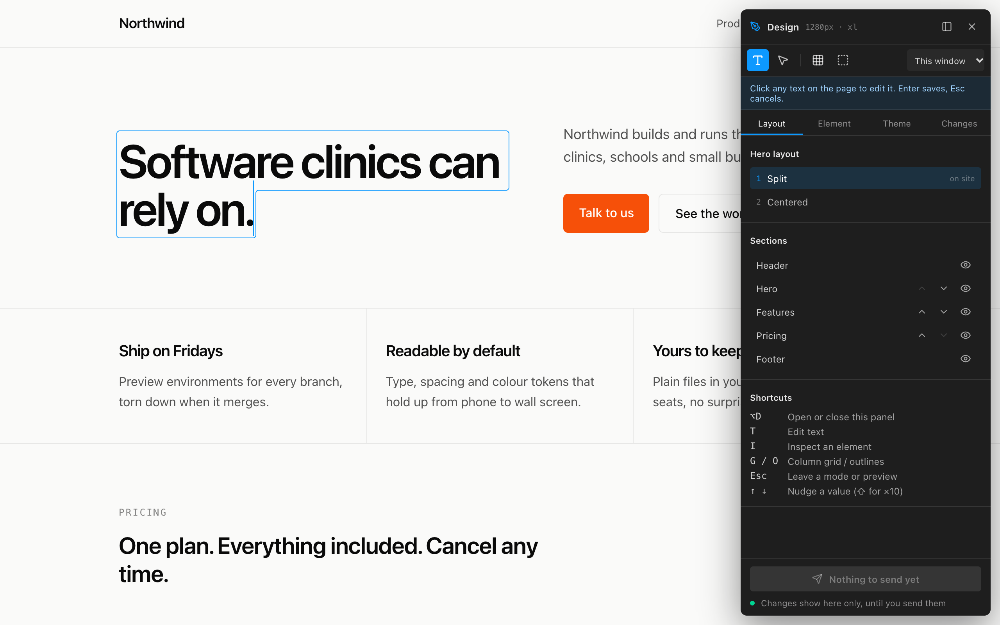
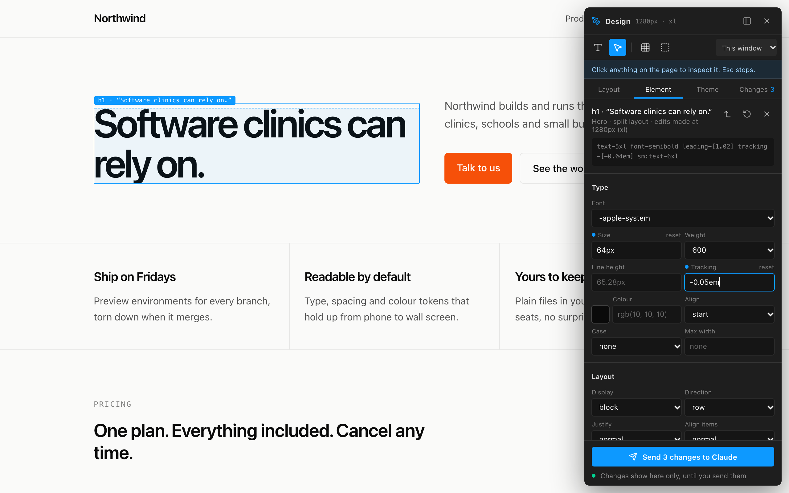
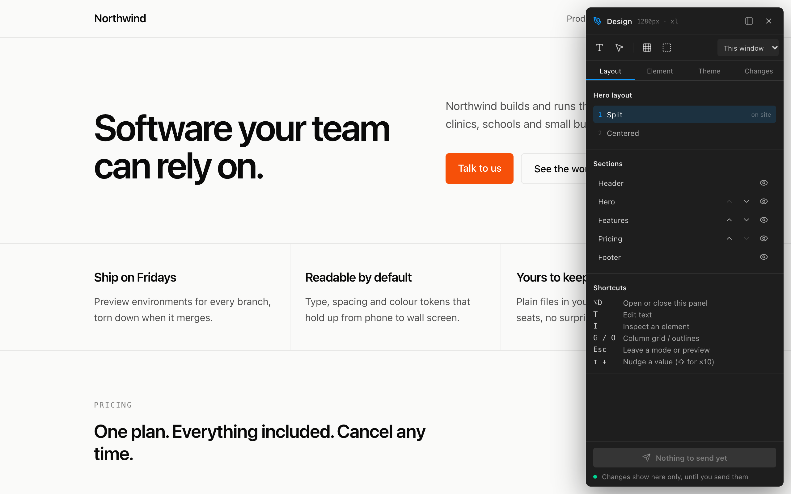
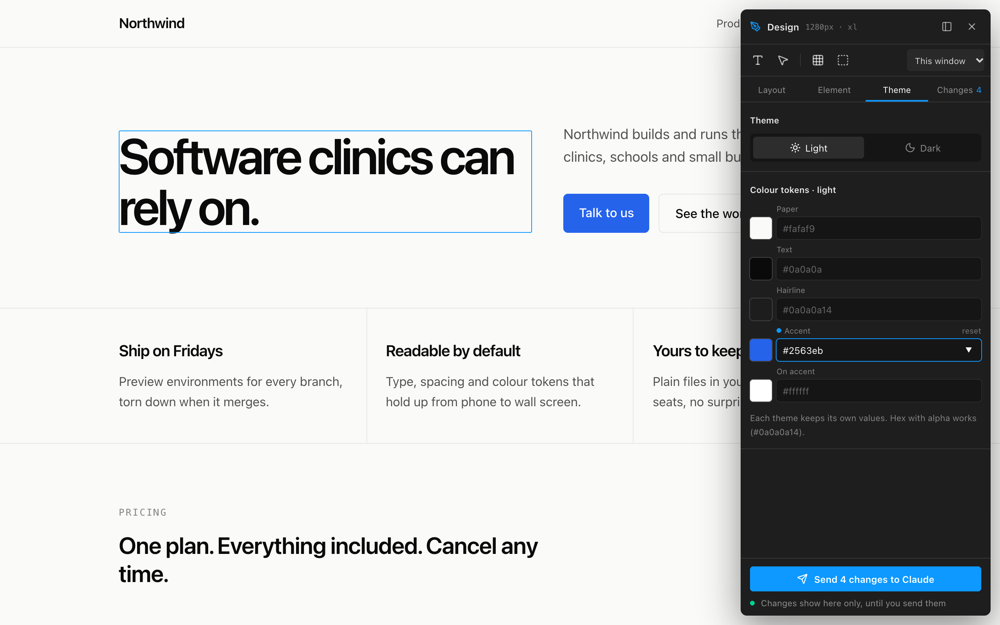
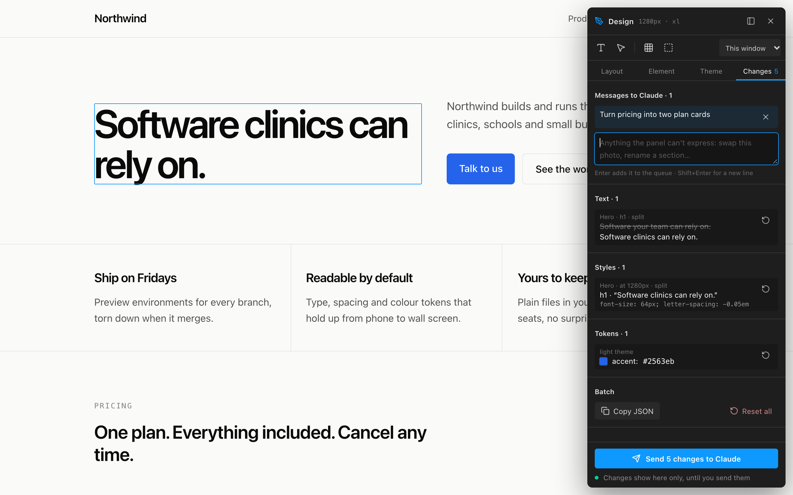
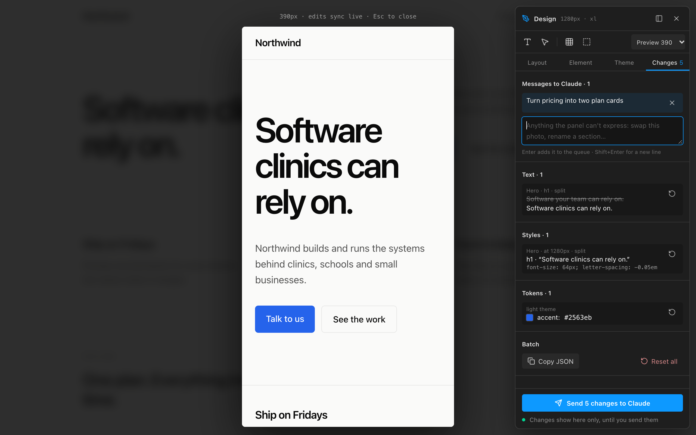

# dsgn-tweaks

A design panel for any website while you develop it. Open it on your local page and design on the real thing:

- **Edit text** in place.
- **Inspect** any element to restyle it.
- **Switch layout options** and **reorder or hide sections**.
- **Retune colours** for light and dark themes.
- **Preview** at phone and tablet widths.

Nothing touches your code while you play. When you're happy, press **Send** and your coding agent (Claude Code, Cursor, …) implements the whole batch at once.

It works with plain HTML and CSS, Vite (React, Vue, Svelte, Solid, Lit…), Next.js, and any other server.



## What it does

| | |
|---|---|
|  **Inspect.** Click any element to change its type, spacing, size, colour, radius and opacity. Arrow keys nudge values. |  **Layouts and sections.** Flip between layout options for sections you haven't decided on; reorder or hide sections. |
|  **Colour tokens.** Retune your palette separately for light and dark themes. |  **Changes and Send.** See every change, revert one, queue notes for things the panel can't do, then send it all. |
|  **Previews.** See the page at 390–1440px with your changes applied. Also a column grid and box outlines. | **Safe by design.** The panel lives in its own sealed-off layer, so your CSS never touches it and its CSS never touches your page. It only runs where you load it. |

Open it with **⌥D** (Alt+D).

## Install

Pick the setup that matches your project. Every package manager works; the commands differ only in spelling:

| | pnpm | npm | yarn | bun |
|---|---|---|---|---|
| Add to a project | `pnpm add -D github:TheStevenShyaka/dsgn-tweaks` | `npm i -D github:TheStevenShyaka/dsgn-tweaks` | `yarn add -D github:TheStevenShyaka/dsgn-tweaks` | `bun add -d github:TheStevenShyaka/dsgn-tweaks` |
| Run the CLI | `pnpm exec dsgn-tweaks` | `npx dsgn-tweaks` | `yarn dsgn-tweaks` | `bunx dsgn-tweaks` |

Once it's published to the npm registry, `github:TheStevenShyaka/dsgn-tweaks` becomes just `dsgn-tweaks`.

### Plain HTML, no install

Add one line to any page, before `</body>`:

```html
<script src="https://cdn.jsdelivr.net/gh/TheStevenShyaka/dsgn-tweaks@main/dist/dsgn-tweaks.global.js"></script>
```

With no server to talk to, changes are kept in your browser, and Send downloads the batch as a JSON file (also copied to your clipboard) for you to give to your agent. Remove the line when you're done.

### Plain HTML, or any other server, with the CLI

Serve a folder with the panel added and Send writing straight into your project:

```bash
pnpm exec dsgn-tweaks ./site           # http://localhost:4800
```

Already running a dev server (Django, Rails, Laravel, PHP, Hugo, Jekyll, WordPress…)? Put the panel in front of it. Websocket traffic, including live reload, is passed straight through:

```bash
pnpm exec dsgn-tweaks --proxy http://localhost:8000
```

Options: `--port <n>` (default 4800), `--dir <path>` (working folder, default `.design`).

### Vite: React, Vue, Svelte, Solid, Lit or vanilla

```js
// vite.config.js
import { dsgnTweaks } from "dsgn-tweaks/vite";

export default {
  plugins: [dsgnTweaks({ /* config, see below */ })],
};
```

It runs only on `vite dev`. Production builds are untouched.

### Next.js (App Router)

```ts
// app/api/dsgn-tweaks/route.ts
import { createDesignRoute } from "dsgn-tweaks/server";

export const dynamic = "force-dynamic";
export const { GET, PUT, POST } = createDesignRoute();
```

```tsx
// app/page.tsx (or a layout)
import { DsgnTweaks } from "dsgn-tweaks/next";

{process.env.NODE_ENV === "development" && <DsgnTweaks config={config} />}
```

### React without Next.js

```tsx
import { DsgnTweaks } from "dsgn-tweaks/react";

{import.meta.env.DEV && <DsgnTweaks config={config} />}
```

### Everything else: Astro, SvelteKit, Nuxt, Remix, Hono…

Call `init` from client code in development:

```js
import { init } from "dsgn-tweaks";

if (import.meta.env.DEV) init({ /* config */ });
```

For saving and Send, answer `/api/dsgn-tweaks` with the standard Request → Response handler:

```js
import { handleRequest } from "dsgn-tweaks/server";

export const GET = ({ request }) => handleRequest(request); // same for PUT and POST
```

Node servers (Express, Connect) can use `createNodeMiddleware()` instead. Without any route, it falls back to browser-only mode.

## Mark your sections (optional)

Put `data-design-root` on the element that wraps your page sections; without it the panel uses `<main>`. Each child is a section:

- **Key:** its `data-design-section`, else its `id`.
- **Label:** its `data-design-label`, else the key in words, else its first heading.

The first `<header>` and the last `<footer>` outside the root are handled as Header and Footer.

## Config

Pass it to the Vite plugin, `<DsgnTweaks config>`, `init()`, or set `window.dsgnTweaks = { … }` before the script tag. Every field is optional.

```js
{
  // Sections with alternative layouts. Your page reads the search param (?hero=centered) and
  // renders that option; the first option is the default.
  explorations: [
    { param: "hero", label: "Hero", options: [{ id: "split", label: "Split" }, { id: "centered", label: "Centered" }] },
  ],
  // Colour tokens, as CSS variables --color-{key} (Tailwind v4 naming). `aliases` follow along.
  tokens: [
    { key: "paper", label: "Paper", light: "#fafaf9", dark: "#0a0a0a" },
    { key: "accent", label: "Accent", light: "#f65009", aliases: ["brand"] },
  ],
  // How your site switches themes: an attribute on <html> set to "dark", or attribute "class"
  // for a `dark` class (Tailwind's default). storageKey remembers the choice.
  theme: { attribute: "data-theme", storageKey: "theme" },
  fonts: [{ value: "var(--font-serif)", label: "Serif" }], // extra fonts in the inspector
  storage: "auto",              // "auto" | "server" | "browser"
  endpoint: "/api/dsgn-tweaks", // where the server answers
  agentName: "Claude",          // who the Send button names
  navigate: (url) => router.push(url), // your router, for layout switches (JS config only)
}
```

## Sending to your agent

Changes autosave to `.design/tweaks.json` as you work, but they only change what you see; they queue in the Changes tab. **Send** hands everything queued to your agent as one batch, written to `.design/outbox/<time>.json`. While the agent works:

- The panel shows "implementing" and locks Send.
- Items already sent are tagged "with Claude", and anything new you edit queues for the next Send.

When the agent moves the batch out of the outbox, the panel clears what was sent and shows the agent's reply from `.design/reply.json`. [AGENTS.md](AGENTS.md) is the guide to give your agent.

Add `/.design/` to your `.gitignore`.

## Shortcuts

| Key | Action |
|---|---|
| ⌥D | Open or close the panel |
| T | Edit text (Enter saves, Esc cancels) |
| I | Inspect an element |
| G / O | Column grid / outlines |
| ↑ ↓ | Nudge a value (⇧ for ×10) |
| Esc | Leave a mode or preview |

## Working on dsgn-tweaks

```bash
pnpm install
pnpm build            # dist/: compiles the panel CSS, then every entry
pnpm example:html     # http://localhost:4800, through the CLI
pnpm example:vite     # http://localhost:5180, through the Vite plugin
pnpm example:next     # http://localhost:3100, through dsgn-tweaks/next
pnpm typecheck
```

Source lives in `src/`:

- `core/`: the store, the DOM engine, settings and the location helper.
- `panel/`: the UI. It's written in Preact and bundled in, so host pages need nothing.
- `server/`: storage handlers.
- `vite.ts`, `react.ts` and `next.ts`: the adapters.
- `cli.ts`: the command-line tool.
- `auto.ts`: the script-tag build.

`dist/` is committed, so GitHub installs and the jsDelivr link work without a build step; run `pnpm build` before committing.

Automated checks should add `?designfile=test` to the URL, so they write `.design/tweaks.test.json` and `.design/outbox-test/`, never the real files.

MIT licensed.
